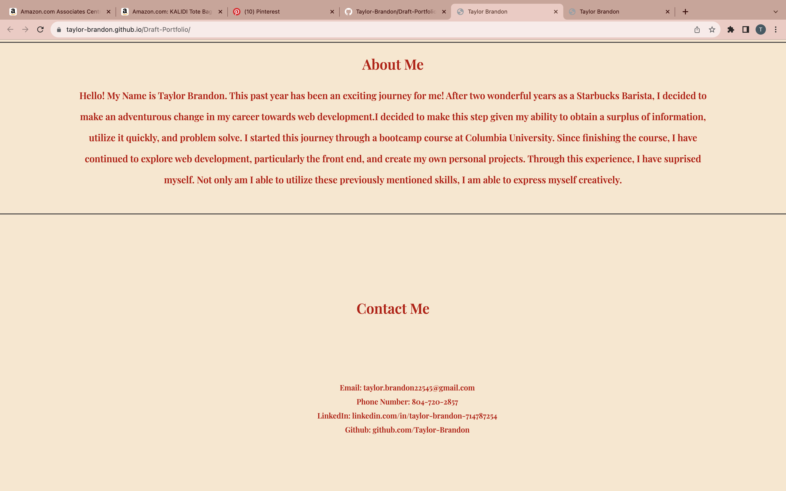

## Taylor Brandon's Draft Portfolio Website

# Description
This website is a first draft version of my project portfolio. This will include. . .

1. My name, avatar, links to sections about me, my work, and how to contact me.

2. Links found on the navigation bar will scroll to the corresponding section. 

3. When clicking on the designated section about my work, the UI will scroll to the each website that includes an image and a title.

4. When presented with the first project, the website will be larger in size than the others. 

5. When users click on the image, then they are redirected to that deployed project.

6. When the website is resized or viewed on various screens and devices, then they are presented with a responsive layout that adapts to their viewport.

## Table of Contents

1. [Project Title](#project-title)
2. [Description](#description)
3. [Table of Contents](#table-of-contents)
4. [Installation](#installation)
5. [Usage](#usage)
6. [Contributing](#contributing)
7. [License](#license)
8. [Acknowledgements](#acknowledgements)
9. [FAQs](#faqs)
10. [Support](#support)
11. [Version History](#version-history)
12. [Authors](#authors)
13. [References](#references)
14. [Screenshots](#screenshots)
15. [Demo](#demo)

# Installation
In order to explore this project in greater depth locally on your machine, please follow these steps:

1. Clone the repository to your local machine.
2. Open the project folder in your preferred code editor.
3. Double-click the 'index.html' file to view it in your web browser.

# Usage
In order to use this application, access the live demo link found below. Then, users are able to explore links for details about myself, my work, and how to contact me using the navigation bar. Once a link is clicked, the application will then scroll to the corresponding section. Users are able to read inforation about myself and how to contact me. Additionally, after navigating to my projects, images that are accessed are able to relocate to that appropriate website. 

# Contributing
Those who would like to explore this project and contribute themselves are able to do so locally on their machine by cloning the repository. Additioanlly, they are able to make sugestions by making Github issues that will allow for bugs, inspiration, and further suggestions to be identified. 

# License
This project includes an MIT License. The documentation for this can be found here [MIT License](./LICENSE)

# Aknowledgements
A special thanks to Columbia University Bootcamps for providing the educational material as well as the inspiration and criteria for this project!

# Support
If you have any questions, suggestions, or feedback, you can reach out to the project maintainer at  or create an issue on the GitHub repository.

# Version History
* Version 1.0.0 (Initial Release)
    * Basic HTML and CSS structure    
    * README file created
    * Live demo link added

# References
The rerences used for this application can bee found here. . .

1. [google fonts](https://fonts.google.com/).

# Screenshot

# Demo

